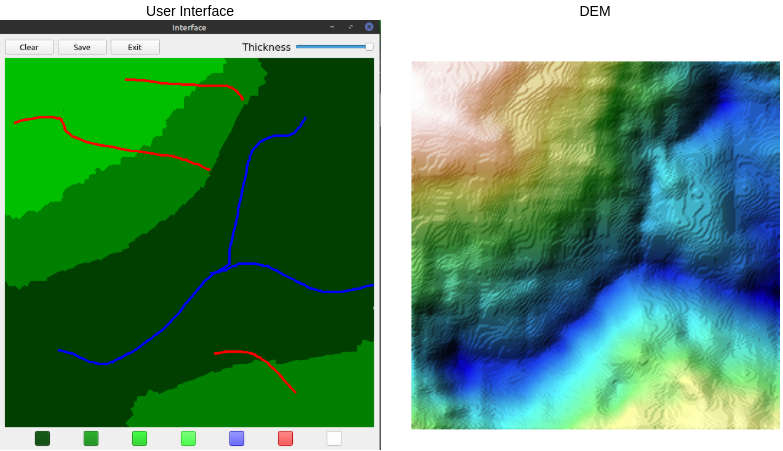

# TerrainAuthoring-Pytorch

This is the code for the paper **Deep Generative Framework for Interactive 3D Terrain Authoring and Manipulation**(link).


## Installation.
Please install [conda](https://docs.anaconda.com/anaconda/install/index.html). Create a new environment and install all the dependencies using the following command
```
conda env create --file environment.yml
```

## Dataset

## Experiments
The proposed architecture is composed of *VAE* and *Pix2pix* architectures. We have referred the [PyTorch-VAE](https://github.com/AntixK/PyTorch-VAE) repository for the VAE implementation.
 
## Training the model
To train the model in trained in two steps. To train the VAE model, set the *load_model* parameter in *train.yml* to False. To train the *pix2pix* model use the following command. The checkpoints will be saved in *logs* directory.
```
python train.py --config configs/train.yml
```


## Testing the model

## Use the UI
The given model can be used to render the terrains in an interactive mode. 

Use the following command to run the UI. 
```
python ui.py
```
If there are errors due to incompatibility , uninstall opencv and reinstall it using the command
```
pip install opencv-python-headless 
```


## Terrain Interpolation
The model can be used to smoothly interpolate between the given two terrains


## Terrain Varitions
